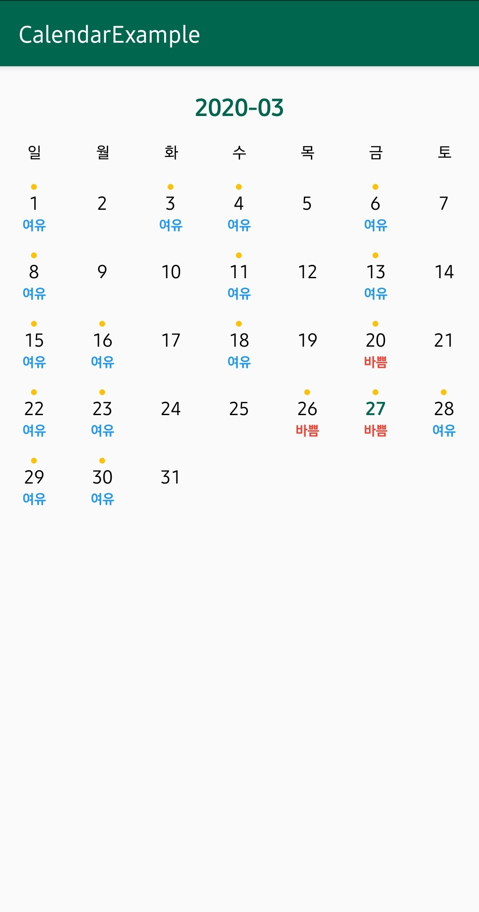

# :calendar: 간단한 커스텀 달력 앱

이 앱은 2020-1 DSC EWHA 미니 세미나를 진행하기 위해 개발한 간단한 커스텀 달력 어플리케이션입니다.
1. 구글 캘린더의 일정을 불러와 달력에 표시합니다.
2. 일정의 개수에 따라 **바쁨**과 **여유**로 표시합니다.

## :camera: Screenshots


## :art: Project Structure
```
📁 app/src/main/java/org/jionchu/calendarexample
 ├ 📄 MainActivity.java : 일정을 불러와 캘린더에 표시하는 화면
 └ 📄 Scedule.java : 캘린더 일정 데이터 모델
```

## :hammer: Development Environment
- Java
- Android Studio @3.6.1

## :bookmark: Application Version
- minSdkVersion : 21
- targetSdkVersion : 28

## :books: Libraries Used
- [CalendarView](https://github.com/kizitonwose/CalendarView) : custom calendar 라이브러리
